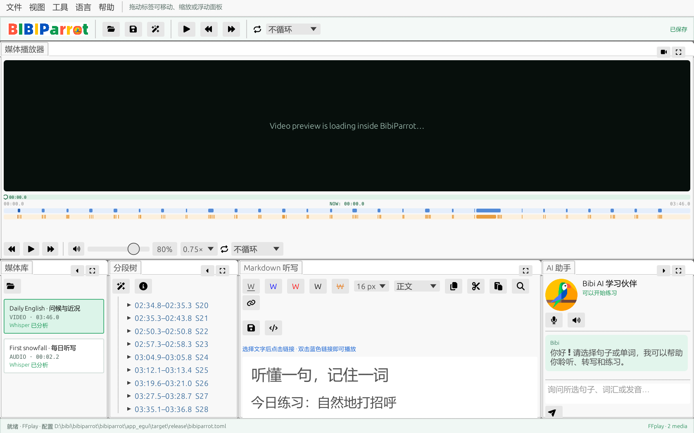
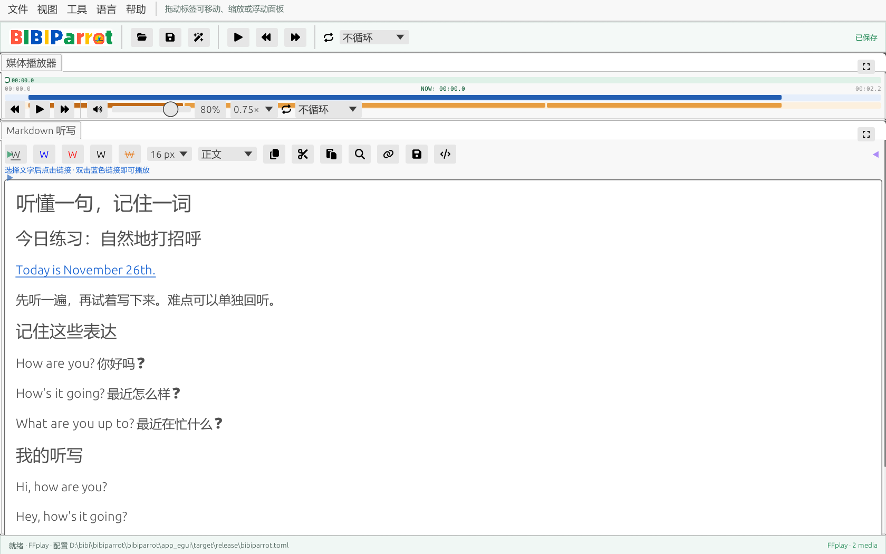

<h1 align="center">听懂一句，记住一词。</h1>

把喜欢的音频和视频，变成自己的外语精听与听写课堂。

<a href="https://github.com/bibiparrot/bibiparrot/releases/latest">下载 BibiParrot</a> · <a href="https://github.com/bibiparrot/bibiparrot/issues">反馈与建议</a>

听播客时总有一句跟不上？看外语视频时，听见了单词却来不及记下来？BibiParrot 把播放器、句子和单词、听写笔记放在一起，让你从反复拖进度条进入专注练习。

## 为认真练听力的人准备

| 你想做的事 | BibiParrot 帮你做到 |
| --- | --- |
| 听清一句难句 | 点击句子回放，开启循环，反复听到熟悉为止 |
| 抓住一个没听懂的词 | 在分段树或单词时间条选择它，单独重听 |
| 跟上快语速 | 调整播放速度，从慢速练习回到自然语速 |
| 边听边写 | 在同一窗口完成听写，整理标题、重点和学习笔记 |
| 让笔记保留声音 | 把文字链接到句子或单词，双击蓝色文字就能回听 |
| 用自己的学习材料 | 打开本地音频或视频，建立个人媒体库 |
| 接着上次继续练 | 自动保存媒体记录和听写笔记，重新打开继续学习 |

## 让练习更顺手的特色

### 笔记里的文字，就是声音的书签

记下容易混淆的表达，选中文字，再点“链接当前片段”。以后复习时，双击这段蓝色文字，就能重听对应的句子或单词。笔记与声音相连，复习不再需要寻找时间点。

### 从整段材料，到一句、一词

打开音频或视频后，BibiParrot 自动识别语音并整理分段。句子和单词都有自己的播放范围；你可以完整听一遍，再把时间花在真正需要练习的地方。

分段根据停顿和识别文本整理。背景音乐、噪声和说话习惯会影响边界，使用时可以配合时间条回听。

### 离线识别，让学习材料留在本机

发布包包含语音模型。识别在电脑上完成，无需上传课程音视频，也无需配置云端识别账号。首次使用即可从自己的文件开始。

### 一个工作区，按你的习惯摆放

视频直接显示在播放器中。媒体库、分段树、听写和练习助手面板可以拖动、调整大小、收起或放大。想专心听写，就给笔记留出更多空间；想对照视频，就放大播放器。

### 学习节奏由你决定

单次播放与循环播放、速度调整、静音与音量控制，让精听、听写和跟读可以在同一份材料上切换。练习助手提供当前片段的练习提示，并可使用系统语音朗读提示。

界面支持中文、英语、日语、韩语、法语、西班牙语、俄语和拉丁语。

## 三步开始练习

1. **打开材料。** 下载并启动 BibiParrot，打开你喜欢的本地音频或视频。
2. **选一句来听。** 等待识别完成，点击句子或单词，按需要放慢速度或开启循环。
3. **写下来，留下声音。** 在听写面板记录内容，把难点文字链接到音频，下次复习双击就能回听。

你可以先用软件自带的简短示例熟悉操作，再加入播客、对话、课程或自己的录音。

## 下载适合你的版本

所有下载均在 [最新发布页](https://github.com/bibiparrot/bibiparrot/releases/latest)，并附带校验文件 `SHA256SUMS.txt`。

| 系统 | 处理器 | 下载格式 |
| --- | --- | --- |
| Windows | x86_64 | `.zip`，解压后运行 `bibiparrot.exe` |
| macOS | Apple Silicon / arm64 | `.dmg`、`.pkg`、`.zip` |
| macOS | Intel / x86_64 | `.dmg`、`.pkg`、`.zip` |
| Linux | x86_64 | `.AppImage`、`.rpm`、`.tar.gz` |
| Linux | aarch64 | `.AppImage`、`.rpm`、`.tar.gz` |

macOS 的 DMG 可将应用拖入“应用程序”，PKG 提供安装引导；当前发布未经过 Apple 公证，如系统阻止打开，可在“系统设置 → 隐私与安全性”允许本次打开。Linux 版本适用于 Ubuntu 24.04 及兼容环境（glibc 2.39 或更新）；AppImage 需要执行权限，tar.gz 解压后运行 `BibiParrot`。

媒体播放工具和离线语音模型随包提供。你的听写和分段资料保存在本地，每份材料有独立的学习工作区，方便备份与整理。

## Hear it. Write it. Remember it.

BibiParrot turns your own audio and video into a focused language listening workspace. Replay a sentence or a single word, slow down difficult passages, write formatted study notes, and link any text directly to its audio. Offline speech models and media tools are included. Arrange the panels to suit your practice and continue with locally saved notes.

[Download for Windows, macOS and Linux](https://github.com/bibiparrot/bibiparrot/releases/latest).

## 一起把 BibiParrot 做得更好

欢迎在 [Issues](https://github.com/bibiparrot/bibiparrot/issues) 分享使用体验、问题和想要的练习功能。反馈播放或识别问题时，请附上系统版本、软件版本和问题出现的步骤。

第三方资源与许可见 [THIRD_PARTY_NOTICES.md](THIRD_PARTY_NOTICES.md)。
